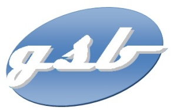

# Laboratoire Galaxy-Swiss Bourdin 

Cette application est développée dans le cadre des Ateliers de Professionnalisation du BTS SIO SLAM pour la session 2025. Elle vise à centraliser et uniformiser la gestion des frais de déplacement, de restauration et d'hébergement des visiteurs médicaux du laboratoire Galaxy Swiss Bourdin (GSB).

L'objectif principal est d'améliorer l'efficacité et la transparence dans la gestion des frais tout en répondant aux exigences du cahier des charges et des épreuves associées (E4 et E5).
